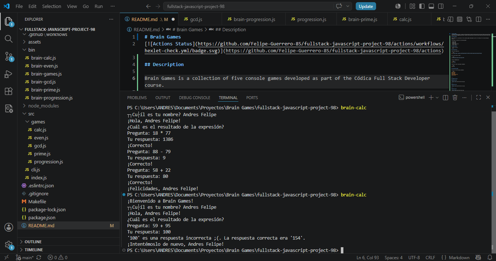
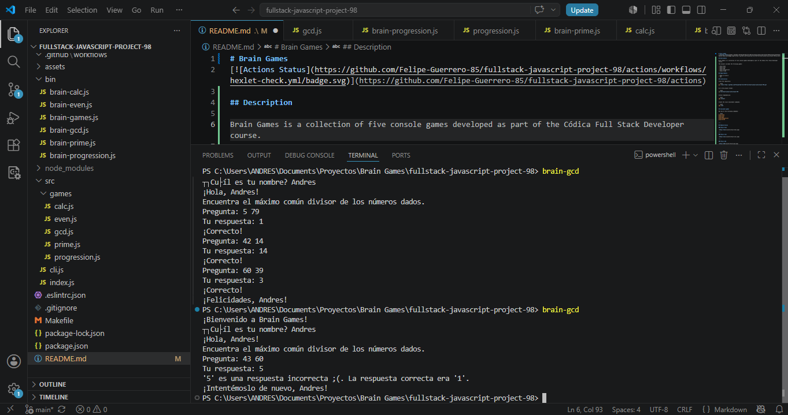
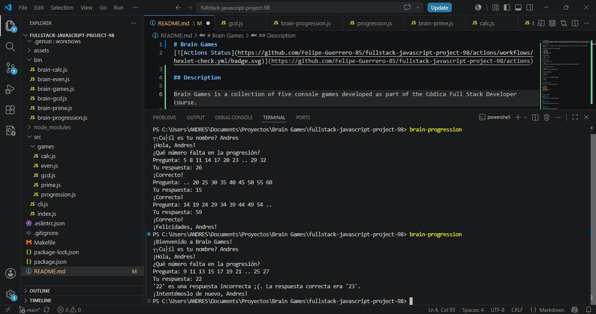
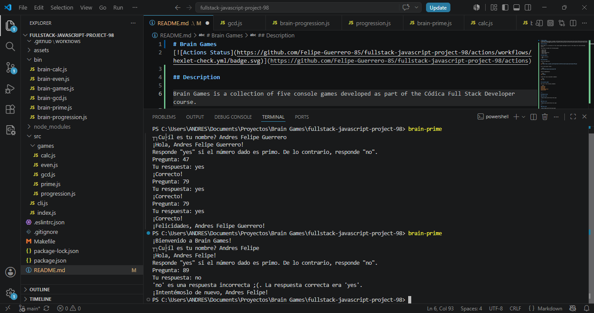

# Brain Games
[](https://github.com/Felipe-Guerrero-85/fullstack-javascript-project-98/actions)

## Description

Brain Games is a collection of five console games developed as part of the Códica Full Stack Developer course.

The project includes the following games:

- Brain Even
- Brain Calc
- Brain GCD
- Brain Progression
- Brain Prime

## Requirements

- Node.js 18.18.2
- npm

## Installation

Clone the repository:

```bash
git clone https://github.com/Felipe-Guerrero-85/fullstack-javascript-project-98.git
```

Go to the project folder:

```bash
cd fullstack-javascript-project-98
```

Install dependencies:

```bash
npm install
```

Create the local executable commands:

```bash
npm link
```

## Available games

Run any of the following commands:

```bash
brain-even
brain-calc
brain-gcd
brain-progression
brain-prime
```

---

## Demonstration

### Brain Even


---

### Brain Calc



---

### Brain GCD



---

### Brain Progression



---

### Brain Prime

